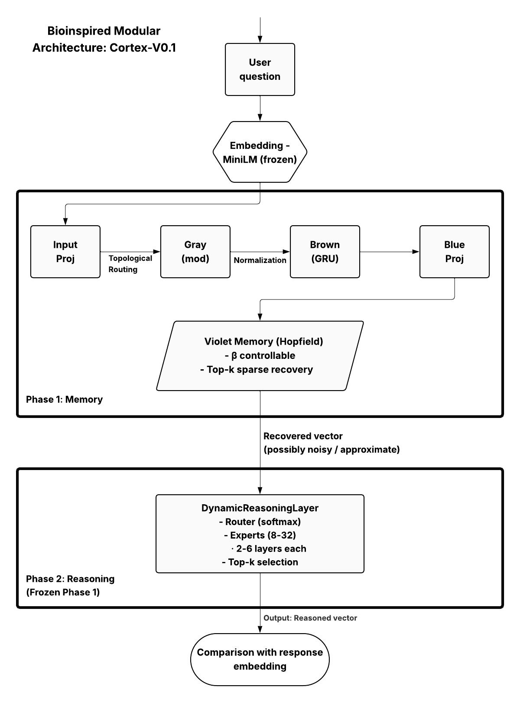

# Cortex-V0.1: Bio-Inspired Modular Architecture for Efficient Memory and Reasoning

**Compact Prototype (<15M trainable parameters) – Preliminary Results**

[](https://www.python.org/)
[](https://pytorch.org/)
[](https://colab.research.google.com/github/YOUR_USERNAME/cortex-v01/blob/main/Cortex_V0.1.ipynb)

A bio-inspired modular neural architecture that explicitly separates **long-term associative memory** (modern Hopfield network) from **dynamic reasoning** (Mixture of Experts). Trained in two phases with parameter freezing, it achieves emergent expert specialization (visualized via PCA) and robust semantic similarity (~0.6) even with imperfect memory retrieval (~0.01 recall@5).

Developed in **12 days** as an independent self-taught researcher (23 years old) using Google Colab + T4 GPU. Inspired by a dream and biological principles (hippocampus + prefrontal cortex).

### Key Results (Preliminary)
- Semantic similarity improvement: up to **0.6** (MoE) vs. ~0.42 (dense MLP ablation).
- Emergent specialization: Clear PCA clusters by question type (math/history/facts) without supervision.
- Extreme efficiency: <15M trainable params total, low GPU usage (50-60%, 30-40W).
- Full reproducibility on free Colab.

### Quick Links
- 📄 **Paper** (English): [Cortex-V0.1_EN.pdf]([docs/Cortex-V0.1_Paper_EN.pdf](https://github.com/Arian-Space/Cortex_V0.1_proyect/blob/main/Cortex_V0.1%20English.pdf))
- 📄 **Paper** (Español): [Cortex-V0.1_ES.pdf]([docs/Cortex-V0.1_Paper_ES.pdf](https://github.com/Arian-Space/Cortex_V0.1_proyect/blob/main/Cortex_V0.1%20Español.pdf))
- ▶️ **Interactive Colab Notebook**: []([Bio_Inspired_Modular_Architecture_for_Efficient_Memory_and_Reasoning_in_Neural_Networks_Preliminary_Results_of_a_Compact_Prototype_"Cortex_V0_1".ipynb](https://colab.research.google.com/drive/1dAgAtZhGI5ShSLQk_l-gVucXc-VmU0mw?usp=sharing))  
  (Run Phase 1 → Phase 2 sweeps yourself – no local GPU needed!)
- 🔗 **arXiv** (coming soon): Preprint upload in progress
- 💻 **Free peek to the code**: Fully open-source (see notebooks)

### Architecture Overview
The system mimics biological modularity:

1. **Phase 1** — Topological routing + Modern Hopfield memory  
   - Input → Projection → Gray (modifier) → Brown (GRU recurrent) → Blue → Hopfield retrieval (top-k sparse)
   - Frozen after training to preserve memory integrity

2. **Phase 2** — Dynamic Reasoning with Mixture of Experts  
   - Noisy/approximate retrieved vector → Router → Top-k experts (deep FFNs) → Weighted output
   - Robustness to imperfect recall (key bio-inspired property)

  
*Figure 1: Complete flow highlighting modular separation and sparsity*

### Installation & Quick Start (Colab)
Everything runs in free Google Colab (T4 GPU recommended):

1. Open the notebook: []([Bio_Inspired_Modular_Architecture_for_Efficient_Memory_and_Reasoning_in_Neural_Networks_Preliminary_Results_of_a_Compact_Prototype_"Cortex_V0_1".ipynb](https://colab.research.google.com/drive/1dAgAtZhGI5ShSLQk_l-gVucXc-VmU0mw?usp=sharing))
2. Run cells sequentially:
   - Setup & Data → Phase 1 training → Phase 2 sweeps
3. Monitor results live in your Weights & Biases dashboard (free account)

Requirements (all installed in Colab):
- PyTorch, Sentence-Transformers, Datasets, wandb, scikit-learn, matplotlib

### Citation (BibTeX)
```bibtex
@misc{vazquez2026cortex,
  author       = {Arian Vazquez Fernandez},
  title        = {Bio-Inspired Modular Architecture for Efficient Memory and Reasoning in Neural Networks: Preliminary Results of a Compact Prototype "Cortex-V0.1"},
  year         = {2026},
  howpublished = {\url{https://github.com/Arian-Space/Cortex_V0.1_proyect}},
  note         = {arXiv preprint (pending)}
}
